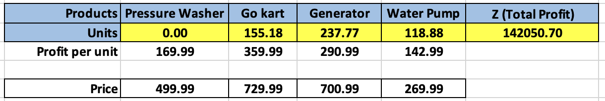

# Profit-Maximization-Linear-Programming

This project uses **Excel Solver** to optimize the product mix for a hardware company by maximizing monthly profit under budget and space constraints.

---

## Problem

Determine how many units of each product (Pressure Washer, Go-Kart, Generator, Water Pump) to stock given:
- $170,000 monthly budget
- 12,300 sq. ft. warehouse space
- Product mix and logical constraints

---

## Solution Overview

**Objective Function:**  
`Maximize Z = 169.99x₁ + 359.99x₂ + 290.99x₃ + 142.99x₄`

**Optimal Output:**  
- x₁ (Washer): 0  
- x₂ (Go-Kart): 155.18  
- x₃ (Generator): 237.77  
- x₄ (Water Pump): 118.88  
- **Total Profit:** $142,050.70

---

## Key Visuals

  
  

---

## Files

- `Solver_Model.xlsx`: Excel file with formulas and Solver setup  
- `Optimization_Report.pdf`: Final report for ALY6050  
- `assets/`: Screenshots of key results

---

## Course Info

 **ALY6050: Intro to Enterprise Analytics**  
 Northeastern University – Spring 2024  
 Prof. Roy Wada

---

This project demonstrates how linear programming can guide real-world decisions using simple but powerful spreadsheet tools.
